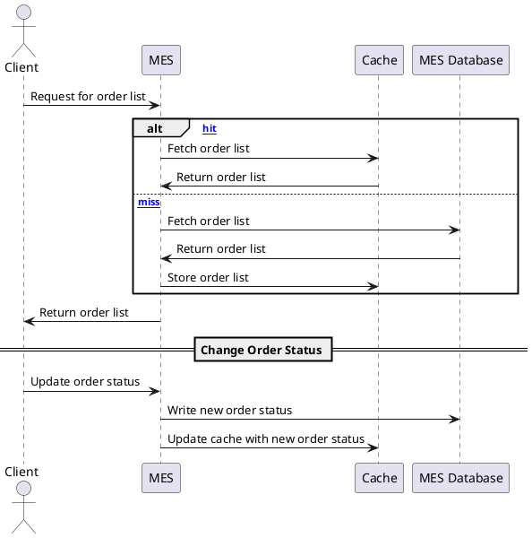

## Мотивация

Внедрение кеширования в систему необходимо по следующим причинам:

1. **Ускорение загрузки данных для операторов.**
    - Кеширование часто запрашиваемых данных, таких как список заказов, позволит сократить задержки при загрузке страницы и улучшить пользовательский опыт операторов.

2. **Снижение нагрузки на сервер MES.**
    - Вместо выполнения длительных операций (например, расчёта стоимости) в режиме реального времени, можно временно хранить результаты в кеше. Это уменьшит количество обращений к базе данных и повысит общую производительность.

3. **Улучшение клиентского опыта.**
    - Быстрое получение данных о статусе заказа и его стоимости ускорит процесс обслуживания заказов для клиентов и внешних API-пользователей.

### Элементы системы, которые следует закешировать:

1. **Список заказов с их статусами.**
    - Для быстрого отображения актуальных заказов без постоянных запросов к базе данных.

2. **Результаты расчёта стоимости.**
    - Ускорит обработку заказов, особенно когда расчёт стоимости занимает длительное время.

3. **Данные о завершённых заказах.**
    - Эти данные редко меняются, и их кеширование позволит сократить обращения к базе данных.

---

## Предлагаемое решение

### Тип кеширования

- Выбрано **серверное кеширование**, так как:
    - Оно снижает нагрузку на сервер, позволяя быстрее обрабатывать запросы операторов и клиентов.
    - Большинство данных (например, список заказов и результаты расчётов) генерируются на сервере, и клиентское кеширование здесь будет недостаточным.

### Паттерн кеширования

**Рассмотрены варианты:**
1. **Cache-Aside:**
    - Данные сначала ищутся в кеше. Если их нет, выполняется запрос к базе данных, и данные добавляются в кеш.
    - Преимущества: Простота реализации, гибкость, снижает нагрузку на базу данных.
    - Недостаток: Возможны проблемы с консистентностью, если запись в кеш не происходит из-за сбоев (например, отмена запроса).

2. **Write-Through:**
    - Данные записываются одновременно и в кеш, и в базу данных.
    - Преимущества: Гарантирует консистентность между кешем и базой данных.
    - Недостаток: Увеличивает задержки при записи (примерно 50-200 мс).

### Итоговый выбор: Write-Through

- С учетом того, что у системы значительно больше **читающей нагрузки**, чем записывающей, задержка в 50-200 мс при записи статуса заказа является допустимой.
- Write-Through обеспечивает консистентность данных и исключает проблему устаревшего кеша при сбоях.

---

### Стратегия инвалидации кеша

Для обеспечения актуальности данных предлагается использовать комбинацию стратегий:

1. **Временная инвалидация (Time-to-Live, TTL):**
    - Автоматическое удаление данных из кеша через определённый интервал времени (например, 15-30 минут).
    - Используется для редко изменяемых данных (например, завершённых заказов).

2. **Программная инвалидация по ключу:**
    - Обновление или удаление данных в кеше при изменении статуса заказа.
    - Гарантирует актуальность данных.

#### Сравнительный анализ стратегий

| Стратегия                  | Подходит для                   | Преимущества                         | Недостатки                          |
|----------------------------|--------------------------------|--------------------------------------|-------------------------------------|
| **Программная инвалидация** | Часто обновляемые данные       | Гарантирует актуальность данных      | Требует обработки событий           |
| **Временная инвалидация**   | Редко изменяемые данные        | Простая реализация, снижает нагрузку | Возможна устарелость данных         |

---

## Диаграмма последовательности действий

### Исправленная версия

или вот [картинка](/Exc5/картинка.png)
